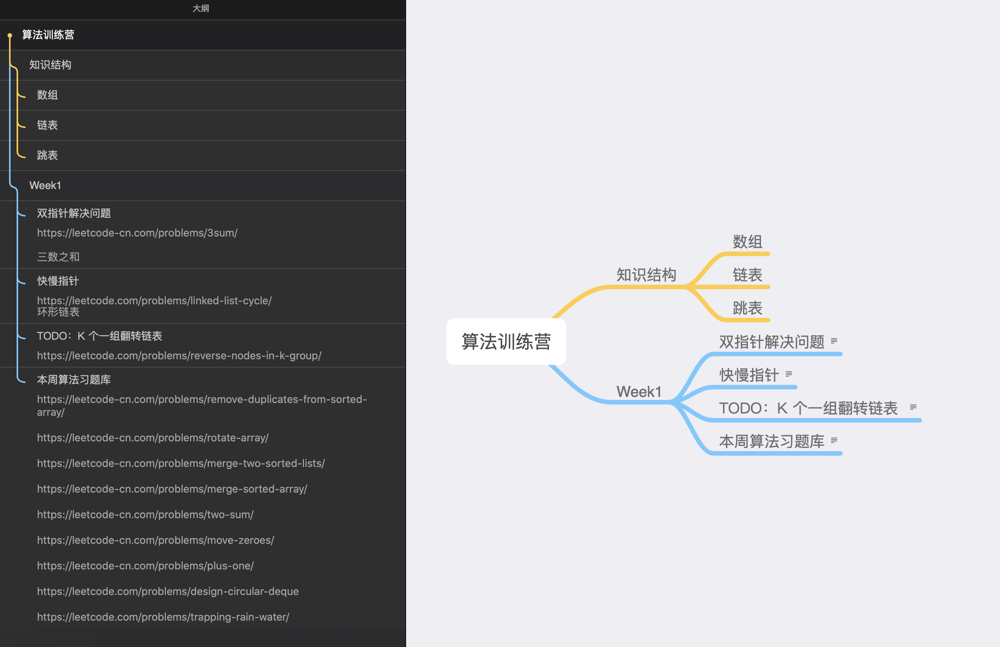

# 学习笔记

# 算法训练营

## 知识结构

- 数组

- 链表

- 跳表

## Week1 学到的知识点

- 双指针解决问题

	[三数之和](https://leetcode-cn.com/problems/3sum/)

- 快慢指针

	[环形链表](https://leetcode.com/problems/linked-list-cycle/)
	

- 本周算法习题库

	[https://leetcode-cn.com/problems/remove-duplicates-from-sorted-array/](https://leetcode-cn.com/problems/remove-duplicates-from-sorted-array/)
	
	[https://leetcode-cn.com/problems/rotate-array/](https://leetcode-cn.com/problems/rotate-array/)
	
	[https://leetcode-cn.com/problems/merge-two-sorted-lists/](https://leetcode-cn.com/problems/merge-two-sorted-lists/)
	
	[https://leetcode-cn.com/problems/merge-sorted-array/](https://leetcode-cn.com/problems/merge-sorted-array/)
	
	[https://leetcode-cn.com/problems/two-sum/](https://leetcode-cn.com/problems/two-sum/)
	
	[https://leetcode-cn.com/problems/move-zeroes/](https://leetcode-cn.com/problems/move-zeroes/)
	
	[https://leetcode-cn.com/problems/plus-one/](https://leetcode-cn.com/problems/plus-one/)
	
	[https://leetcode.com/problems/design-circular-deque](https://leetcode.com/problems/design-circular-deque)
	
	[https://leetcode.com/problems/trapping-rain-water/](https://leetcode.com/problems/trapping-rain-water/)

